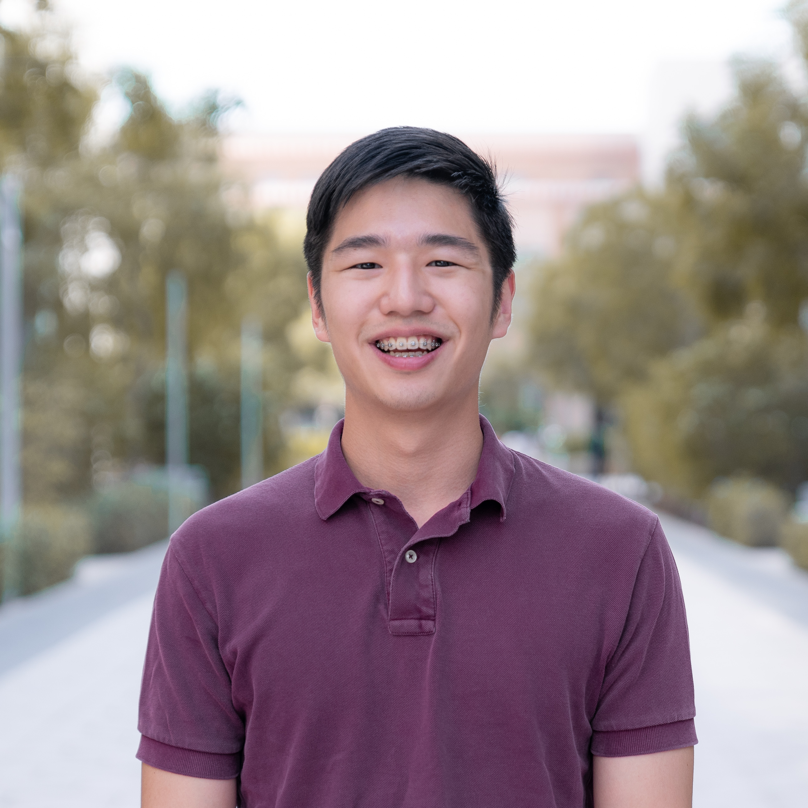

  

## Education
**New York University Abu Dhabi**, Abu Dhabi, UAE  
Expected Graduation: December 2021  
B.S. in *Computer Science*  
Minors in *Interactive Media* and *Psychology*

**Classwork**  
*Computer Science*  
- Algorithms  
- Data Structures  
- Discrete Math  
- Introduction to Computer Science  
- Artificial Intelligence and Human Decisions

*Interactive Media*  
- Introduction to Interactive Media  
- Communications Lab

## Class and Personal Projects
*Class*  
[Intro to IM GitHub Repo](https://github.com/briankim113/Introduction-to-Interactive-Media): A repo of prototypes and codes for various projects for Intro to IM  
[Dirham Miner](https://github.com/briankim113/introfinal): A Processing game for Intro to CS  
[CommLab Final Website](http://hk247.nyuadim.com/index.html): An interactive website for Comm Lab

*Personal*  
[Yeosu-Suncheon Revolution](https://github.com/briankim113/YeoSunRevolution): iOS app to memorialize my hometown's revolution in 1948 
[Choongman Chicken](https://github.com/briankim113/ChoongmanChicken): iOS app for a local fried chicken brand

## Let's Connect!
Email me at hk2473@nyu.edu  
Or contact me over various platforms below:

  
  
  

